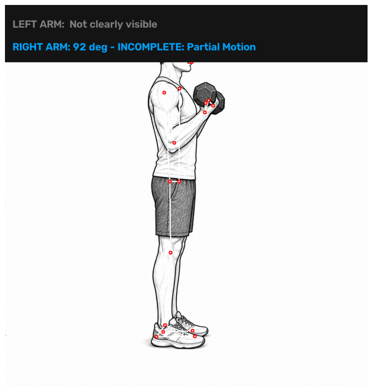
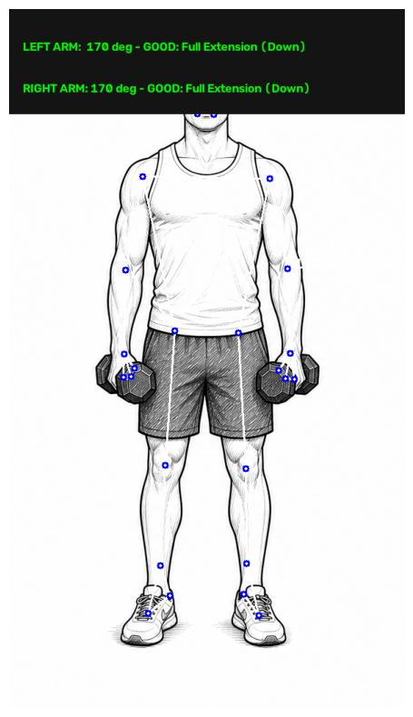

# NeuroGain

A real-time exercise form-correction backend built with **FastAPI**, **MediaPipe**, and **OpenCV**. The API receives camera frames from the client app, runs pose estimation, counts reps, and returns live form feedback.

The full system tracks **5 exercises** (biceps curl, squat, push-up, shoulder press, lateral raise), each with its own rep-counting and form-feedback logic. This public repo includes the **biceps curl** analyzer as a representative sample of the approach — the other four follow the same architecture (joint-angle calculation from pose landmarks → state machine for rep counting → real-time feedback) but are kept private.

## How it works

1. Client sends a single camera frame to `/analyze/biceps`.
2. MediaPipe Pose extracts body landmarks from the frame.
3. Joint angles (shoulder–elbow–wrist) are calculated per arm.
4. A simple state machine (`UP` / `DOWN`) tracks rep transitions and counts reps.
5. Form feedback ("Curl up!", "Lower down!", "Move into frame") is returned alongside the rep count.
6. On reset, the completed set is POSTed to the [MeisterFit](https://meisterfit-2kex.vercel.app) backend to be saved against the user's workout history.

See [`docs/architecture.md`](docs/architecture.md) for more detail on the design decisions.

## Demo

| UP rep (First move) | DOWN rep (Second move) |
|---|---|
|  |  |

Live joint-angle overlays let the analyzer explain *why* a rep is or isn't counted, not just show a number.

## Stack

- **FastAPI** — API layer
- **MediaPipe Pose** — landmark detection
- **OpenCV** — frame decoding
- **NumPy** — angle math
- Deployed on a **Hugging Face Space**, with workout data saved to a Vercel backend

## Running locally

```bash
pip install -r requirements.txt
uvicorn main:app --reload
```

Then POST an image frame (`multipart/form-data`) to `/analyze/biceps`.

## Endpoints

| Method | Route | Description |
|---|---|---|
| GET | `/` | Health check |
| POST | `/analyze/biceps` | Analyze a single frame, return rep count + feedback |
| POST | `/reset/biceps` | Save the completed set and reset the counter |

## Note

This is a graduation project. The biceps curl analyzer here is fully functional and included to demonstrate the pose-analysis approach; the remaining four exercise analyzers use the same pattern but aren't published in this repo.
